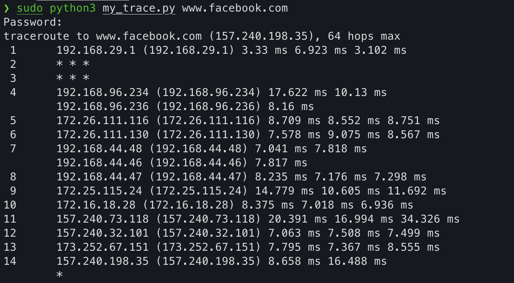
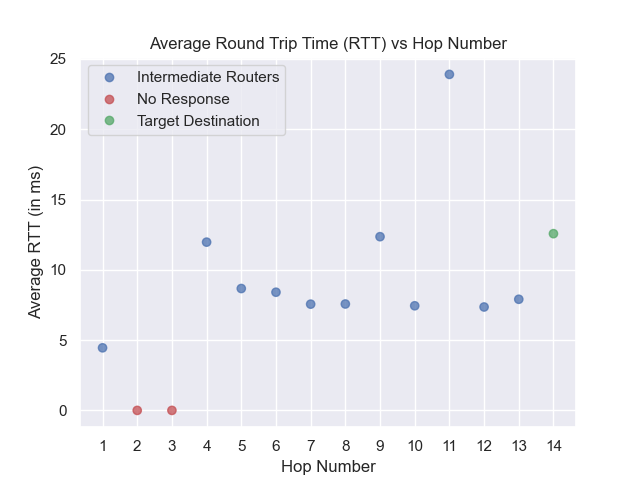

# Traceroute Implementation in Python

A Python script to emulate the functionality of the `traceroute` command. The script takes as a command line input the domain name of the intended receiver. It works by sending ICMP echo messages to the destination with increasing values of the IPv4 TTL Field. It listens to receive an ICMP Time Exceeded message from the routers along the path, and an ICMP Reply message from the final destination. The IP Addresses of the routers that send messages are extracted from the message header, and the round trip times are calculated using a timer on the sender.

This was done as a part of Assignment 1 for the course *Computer Networking* at IIT Delhi in Fall '21. Some important features are:

- I use ICMP Echo packets instead of UDP Datagrams used by the original `traceroute`. This is because the UDP version relies on the assumption that the port on the destination host is not active. As mentioned [here](https://wiki.geant.org/display/public/EK/VanJacobsonTraceroute), many modern implementations have replaced UDP with ICMP (including the Windows `tracert`), and historical reasons for choosing UDP no longer exist.

- Libraries used include just the `socket` library, and the `struct` library for packing bytes. I construct packets as well as unpack them to check header fields.

- The script contains three configuration variables, which can be customised. It doesn't provide a way to set them through command-line options however, so they will have to be changed in the source code. For instance, the `NUM_PROBES` variable sets how many probes to send out for each `ttl` value. Currently it is set to 3, like the default in `traceroute`.

    
    Example Script Output

